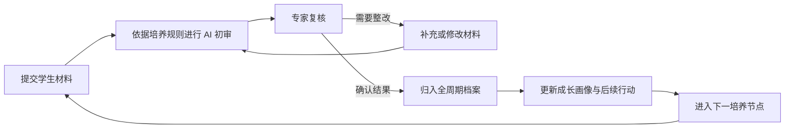

# InnoGrad

研究生全培养周期智能审核与成长管理系统。

InnoGrad 面向研究生培养全过程，计划依托 [Inno-Agent](https://hhyqhh.github.io/inno-agent-website/) 建设。系统以培养规则为依据、以学生材料为证据、以 AI 智能审核为核心、以专家复核为保障，形成“审核—整改—归档—成长”的全周期管理闭环。

让学生知道“该做什么”，让教师知道“怎么审”，让学院知道“哪里需要管”。

**项目状态：需求分析阶段。** 当前仓库提供需求文档、目录结构和协作模板，尚无可运行版本。下文介绍的是规划中的功能。

## 项目背景

研究生培养涉及多个阶段，各阶段的制度要求、学生材料和审核记录需要连续关联。学生需要了解培养进度与待补事项，教师需要核对材料与评价依据，学院需要发现节点问题并跟踪处理。

InnoGrad 计划通过智能审核与专家复核减少重复核对，将审核、整改和培养过程中的记录沉淀为学生档案，为后续成长指导与培养管理提供依据。

## 面向谁

| 用户入口 | 产品 | 核心问题 |
| --- | --- | --- |
| 学生端 | 成长导航 | 我现在在哪里？还缺什么？下一步做什么？ |
| 教师端 | 智能审核工作台 | 这个学生是否符合要求？为什么？ |
| 学院端 | 培养管理驾驶舱 | 哪些节点有问题？哪些学生需要关注？ |

学生端支持材料准备、预审、进度查看、节点提醒与成长建议；教师端支持查看规则与证据、复核意见和跟踪整改；学院端支持节点监测、待关注学生识别与帮扶跟踪。教师端涵盖导师与审核专家，按各自职责配置权限。

## 核心功能

| 功能 | 计划实现的内容 |
| --- | --- |
| 培养节点智能审核 | 覆盖招生、年度报告、资格审查、开题、中期、预答辩和论文形式审查，依据适用规则核对材料，提示缺项与待复核问题 |
| 智能审核中心 | 统一组织审核任务，关联材料、规则与 AI 初审意见，支持专家复核、退回整改、再次核验和结果确认 |
| 学生全周期档案 | 汇集学生信息、培养计划、课程学分、科研与实践成果，保存材料版本、审核结论和整改过程，形成连续可追溯的培养记录 |
| 成长画像 | 基于可观察证据呈现科研、工程、创新、协作等能力与综合素养的成长变化，支持查看依据、人工修正和后续发展建议 |

申请准备、招生与导师匹配、评奖评优、项目人才匹配及资源配置等场景的功能与边界见[产品范围](docs/requirements/product_scope.md)。

## 审核闭环



审核意见应能定位到适用规则与材料证据，成长判断应保留依据及不确定性。正式审核结论由有权限的人员复核确认，系统保存人工修正、整改和处理记录。

## 技术基础

系统按数据、规则、AI 和应用四个层次组织能力：

| 层次 | 规划内容 |
| --- | --- |
| 数据层 | 组织学生信息、培养计划、课程学分、科研成果和培养节点记录，关联 Word、PDF 等材料及培养制度、评价标准 |
| 规则层 | 将培养要求整理为可执行的检查规则与专家评价依据，明确规则名称、适用对象、阶段、审核条件、所需材料、判断方式和版本 |
| AI 层 | 基于 Agent + Skills 组织材料解析、规则检查、证据关联和初审意见生成，探索多智能体协作，并在关键环节保留人工复核 |
| 应用层 | 提供学生成长导航、教师智能审核工作台和学院培养管理驾驶舱 |

项目计划复用 Inno-Agent 的智能体运行、工作区、Skills、文档处理和分层记忆能力，在此基础上建设培养业务模块。

系统预留一个多角色 Web 应用和一个业务服务端。服务端负责业务流程、正式记录、权限检查、数据隔离与操作审计，并接入智能体能力。具体框架、数据接口与接入方式将在工程设计阶段确定。

## 使用说明

当前可阅读下方文档了解需求与功能规划。安装、运行和部署说明将随首个可运行版本提供。

## 项目文档

| 文档 | 内容 |
| --- | --- |
| [问题定义与产品描述](docs/requirements/problem_definition.md) | 项目要解决的问题、目标用户、业务流程和衡量方式 |
| [产品范围](docs/requirements/product_scope.md) | 各业务领域的功能、边界及验证要求 |
| [平台基础与建设边界](docs/software/platform_reuse.md) | Inno-Agent 的可复用能力与需要建设的业务能力 |
| [协作流程](docs/mgmt/project_workflow.md) | 任务管理、需求反馈、缺陷记录和评审约定 |

## 仓库结构

```text
InnoGrad/
├── README.md
├── AGENTS.md             # 仓库协作约定
├── apps/
│   ├── web/              # 多角色 Web 应用
│   └── server/           # 业务服务与智能体接入
├── docs/
│   ├── requirements/     # 问题定义与产品范围
│   ├── algorithm/        # 规则与评价方法
│   ├── software/         # 平台说明与工程设计
│   ├── mgmt/             # 协作流程与项目管理
│   └── retrospection/    # 反馈与复盘
├── tests/
│   ├── unit/             # 单元测试
│   └── integration/      # 集成测试
├── .github/
│   ├── ISSUE_TEMPLATE/   # 任务、缺陷和需求反馈模板
│   ├── PULL_REQUEST_TEMPLATE.md
│   └── workflows/        # 持续集成
└── tasks/
    └── plan.md           # 阶段交付与验收
```

应用、算法、复盘、测试和持续集成目录目前为预留结构。审核、档案、画像和规则等业务按模块组织，具体实现随需求设计补充。

## 参与贡献

欢迎通过 [Issues](https://github.com/NamingIsVeryVeryHard/InnoGrad/issues) 提供培养业务场景、需求建议和文档反馈。提交前请查看已有讨论，说明具体使用情境、遇到的问题和预期结果。

任务进展见[项目看板](https://github.com/orgs/NamingIsVeryVeryHard/projects/1)。

文档或代码修改可通过 Pull Request 提交，并关联相关 Issue、说明验证结果。详细约定见[协作流程](docs/mgmt/project_workflow.md)。涉及学生材料的示例请先脱敏。
