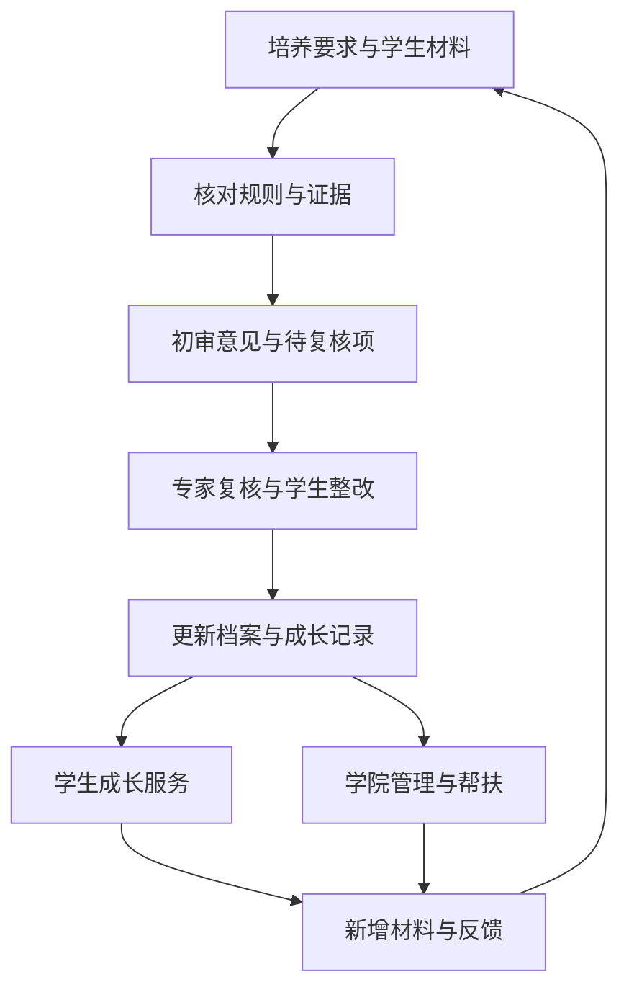

# 工程问题定义与产品描述

## 问题陈述

研究生及培养管理人员需要在招生、学习科研、阶段考核和论文审查过程中，持续确认培养要求是否满足，并据此安排后续行动。项目拟解决的问题是：制度要求、学生材料、审核反馈和成长证据缺少连续关联，导致学生难以判断进度与改进方向，导师和学院需要反复核对信息，也难以持续跟踪培养偏差及帮扶结果。

InnoGrad 希望帮助这些用户在同一组可追溯的依据上完成审核、了解成长状态并采取后续行动。材料审核产生的记录应能服务后续培养，成长信息也应能帮助用户理解下一阶段需要准备什么。

上述问题假设有待用户访谈与业务数据验证，发生频率、耗时和影响程度尚未量化。

## 5W1H

### What：要解决什么问题

项目需要解决培养全过程中四类信息衔接问题：

1. **要求与材料的衔接**：同一份材料需要对应哪些规则，哪些要求已满足，哪些缺少证据或需要专家判断。
2. **审核与整改的衔接**：初审意见依据何处，谁复核了结论，学生是否补充材料，以及问题是否得到处理。
3. **阶段记录与持续成长的衔接**：课程、成果、实践和教师反馈如何形成连续记录，帮助用户了解优势、短板和变化。
4. **状态与行动的衔接**：学生如何准备下一节点或申请，学院如何识别培养偏差、开展匹配或评选，并跟踪支持措施。

### Why：为什么值得解决

对学生，项目希望减少因要求理解不清、材料缺失和反馈遗漏带来的反复准备，并帮助其形成有依据的阶段目标。

对导师和审核专家，项目希望减少重复的信息查找与核对，使其能够直接查看依据，把精力用于需要专业判断的内容。

对学院，项目希望将分散的审核结果转化为持续可用的培养记录，为招生、评奖、培养监测、帮扶、人才匹配和资源配置提供可复核的信息。

### Who：涉及哪些用户和相关人员

| 角色 | 主要任务 | 需要获得的信息 |
| --- | --- | --- |
| 研究生及申请人 | 准备材料、查看进度、修改补交、申请机会、规划发展 | 要求、缺项、审核反馈、成果记录和下一步建议 |
| 导师 | 指导培养与科研，了解阶段进展，参与评价和帮扶 | 学生的实际进展、相关证据、偏差原因和处理记录 |
| 审核专家 | 核查材料和依据，处理主观评价与疑难情况 | 对应规则、材料位置、初审意见和历史反馈 |
| 学院及研究生管理人员 | 组织审核、招生、评奖、培养监测和资源安排 | 可核验的学生信息、待处理事项、过程状态和复核记录 |

### Where：问题发生在哪里

业务范围包括学院或培养单位组织的招生审核、培养过程管理、学位相关节点审查，以及学生日常准备材料和申请机会的过程。

信息来自培养制度、课程与成绩记录、报告、论文、成果证明、项目记录和教师反馈。具体材料来源、现有业务系统及可用接口尚待调查。

### When：在什么情况下需要使用

- 招生及各培养节点提交前，用户需要知道应准备的材料和适用条件。
- 审核期间及意见返回后，相关人员需要核对依据、复核结论并处理整改。
- 学期或学年进展更新、课程与科研成果变化时，学生和导师需要查看培养状态与成长变化。
- 奖学金、项目或其他申请机会出现时，用户需要对照资格条件、研究方向和材料要求。
- 出现节点延误、材料缺失、计划偏差，或规则发生变化时，学院需要识别待核实事项并跟踪处理。

### How：如何判断问题得到有效解决

评估将使用经授权的业务样本，按需要脱敏，并以人工处理结果建立基线。数值目标、样本规模和评价细则在取得材料并与业务人员讨论后确定。

| 关注点 | 衡量方式 | 验证所需依据 |
| --- | --- | --- |
| 核对工作量 | 比较人工处理与系统辅助处理同类任务的总耗时，包含检查和修正系统结果的时间 | 任务记录、处理起止时间和人工基线 |
| 材料与规则检查质量 | 分别记录真实问题的检出情况、漏报和误报，区分规则检查与专家判断 | 指定规则版本、材料样本和经复核的参考结论 |
| 结论可追溯性 | 检查审核意见能否定位到适用规则、材料位置和复核记录 | 规则来源、材料版本、引用位置和操作记录 |
| 学生准备与整改 | 观察用户能否找到缺项、理解下一步操作，并完成修改；记录补交次数及原因 | 用户任务观察、材料版本和整改记录 |
| 画像与成长信息质量 | 检查成果是否可核验，能力判断是否有证据，教师和学生能否发现并修正错误 | 成果证明、过程材料、教师复核和学生反馈 |
| 学院应用价值 | 检查筛选、评奖、监测、预警、匹配和资源配置参考是否符合已确认规则，能否支持后续人工处理 | 业务规则、参考案例、复核意见及帮扶记录 |
| 完整范围与系统可靠性 | 按产品范围逐项完成场景验证，检查跨模块数据衔接、权限和异常处理 | 验收用例、实际结果、权限检查和缺陷记录 |

评估需单独记录解析失败、证据不足、规则歧义及系统与教师判断不一致的案例，分析原因和处理结果。

## 产品描述

### 产品定位

InnoGrad 是拟依托 Inno-Agent 建设的研究生全培养周期智能审核与成长管理系统。系统计划把培养制度、学生档案、文档材料、智能体审核流程和人工复核连接起来，覆盖招生至论文形式审查的七类节点，并将经核验的成果和培养过程记录用于学生画像、成长服务与学院管理。

学生可以通过系统了解培养进度、准备与预审材料、接收节点提醒、对照申请条件并获得成长建议。导师、专家和学院管理人员可以查看审核依据与成长记录，开展招生和导师匹配、评奖评优、培养计划监测、预警帮扶、项目人才匹配及资源配置。

### 主要输入

| 输入 | 用途与必要说明 |
| --- | --- |
| 培养制度、节点要求和评价量表 | 明确适用对象、版本和来源，为审核与评价提供依据 |
| 学生基本档案、培养计划与课程记录 | 关联学生、培养阶段、学业要求和已完成事项 |
| 报告、论文、项目和成果证明 | 支持材料核对与成果账本，保留文档版本和引用位置 |
| 经授权的科研、工程实践及协作记录 | 为能力和成长判断提供可观察证据，区分事实与推断 |
| 专家意见、学生修改及帮扶反馈 | 记录复核、整改和后续变化，避免丢失处理过程 |

Word、PDF、图片及 OCR 结果是计划支持的材料入口。解析结果需要保留与原材料的对应关系，识别失败时应允许补充或修正。

### 业务关系

预期业务流程如下：

节点审核、学生画像和两端应用共用业务记录，每条审核意见与画像信息均需关联材料来源和处理过程。

### 主要输出

- 节点要求清单、缺项与风险提示、初审意见、整改建议及专家复核记录。
- 可核验的成果账本、能力发展图谱、成长曲线、优势与短板、培养计划偏差及待关注事项。
- 学生的进度视图、节点提醒、申请准备清单和发展建议。
- 学院的候选与匹配依据、评选待复核项、培养监测视图、帮扶跟踪记录和资源配置参考。

各业务领域的功能与边界见[产品范围](product_scope.md)。

### 业务边界

招生、资格认定、评奖及学位相关审核的系统输出供有权限的人员复核，最终结论及其责任归属需要明确。系统应支持记录人工修正和理由。

隐性素养与成长判断需要具体行为或成果证据，保留来源、观察期间和不确定性。资料缺失不直接等于能力不足，模型推断不直接作为已经核实的事实。

学院多人使用所需的身份、权限、数据隔离与审计属于产品范围。服务端按用户角色和可访问的学生范围检查每次操作，保存规则与材料版本、审核状态和人工处理记录。界面角色切换不能替代服务端的权限检查。

## 待确认的业务信息

- 适用培养单位的制度、量表、材料模板及版本，以及各节点的实际流程。
- 学生、导师、专家和管理人员的现有做法、主要困难和处理耗时。
- 数据来源与使用授权、画像评价依据，以及学校现有系统的接口条件。
- 经业务人员认可的参考案例，用于建立人工基线和验收标准。
