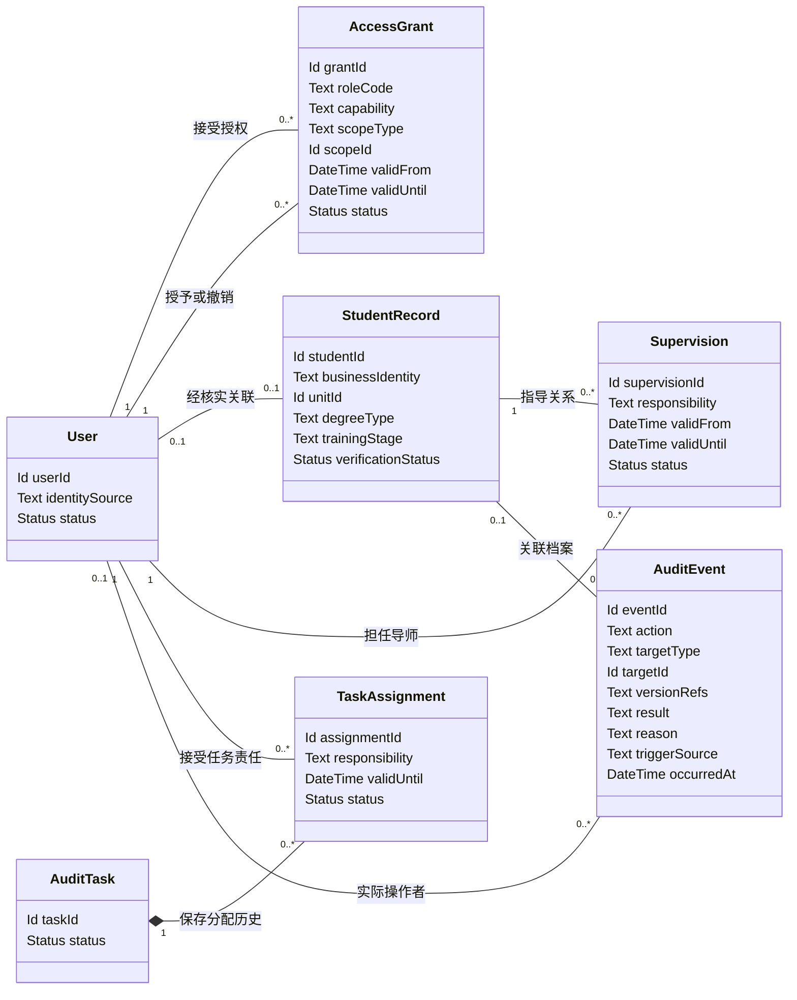
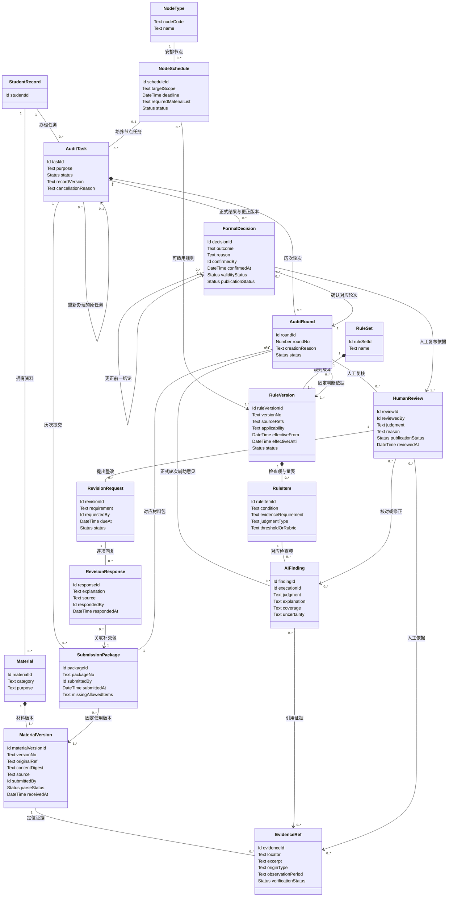
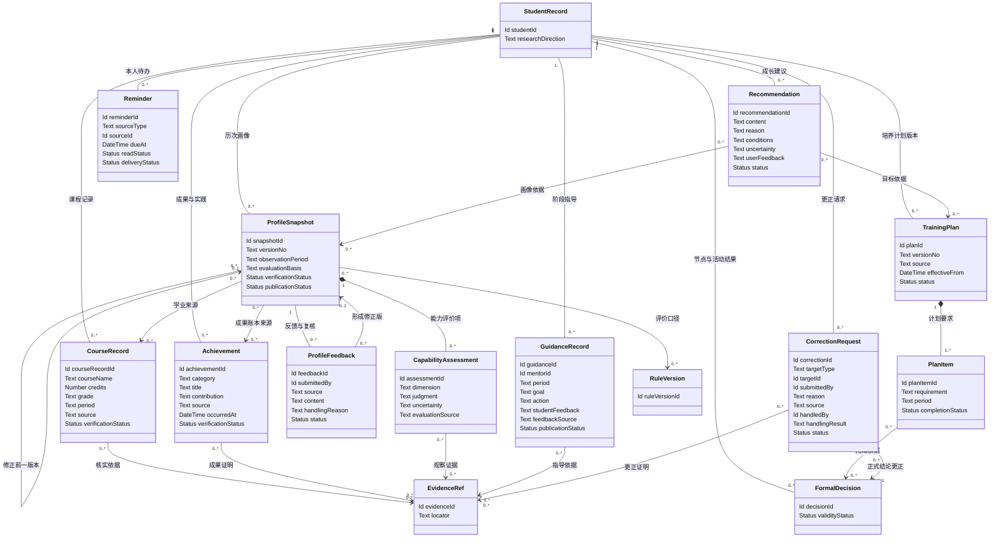
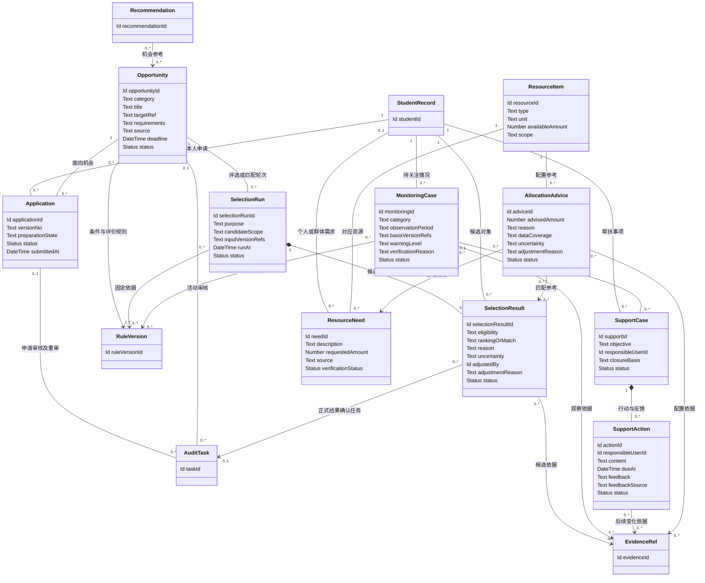
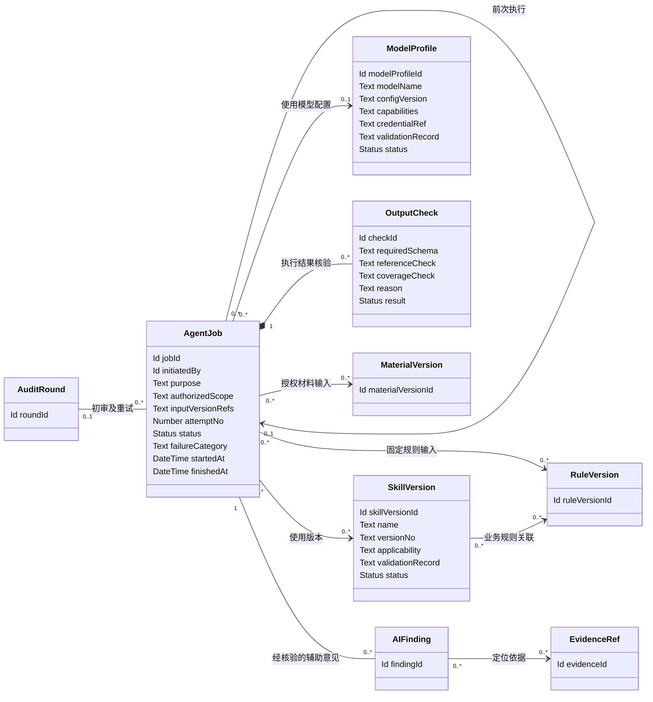

# UML 领域模型

关联任务：[W2-04 UML 领域类图（#7）](https://github.com/NamingIsVeryVeryHard/InnoGrad/issues/7)。

**状态：需求草案，待业务评审，尚未实现。** 本文识别[功能需求](../requirements/functional_requirements.md)中的业务对象及关系。它描述业务概念与约束，不决定数据库表、接口、框架或部署方式。

模型按五个领域视图呈现；重复出现的英文类名表示同一个对象。每个视图列出该范围内的关键属性，完整含义由对象说明和业务约束共同定义。`Id`、`Text`、`Status`、`DateTime` 等是概念类型，集合或结构化值不限定具体存储格式。

模型支持双端共用记录。管理端重点为规则、审核、档案画像和培养管理；学生端通过本人材料、回复、提醒和建议完成简洁业务操作。`StudentRecord` 可以先于学生账号建立，管理人员按授权接收资料或代办时保存来源与实际操作者。

## 图例与关键约定

- `"1"` 表示恰好一个，`"0..1"` 表示可选单个，`"0..*"` 表示零个或多个，`"1..*"` 表示至少一个。关系两端数字表示一个对端对象可关联的本端对象数。
- 实线表示业务关联，带箭头表示主要引用方向；组合关系用于明确从属的版本或明细，不表示可以删除已有历史记录。
- `StudentRecord` 是申请与培养共用的业务档案；`User` 是执行操作的身份，两者不等同。档案可先有记录后建立用户关联，关联须核实。
- `AccessGrant` 表示角色、能力与范围的授权；`TaskAssignment` 表示具体任务责任，不能单独绕过用户的有效能力与数据范围。
- `EvidenceRef` 定位一份材料版本内的页、段或片段；每条证据可附核实状态。对成绩、成果或其他记录的证明关联仍保留其原始来源。

## 1. 身份、授权与操作记录

| 对象 | 含义与属性说明 | 关联需求 |
| --- | --- | --- |
| `User` | 经核实的用户身份；身份来源与账号状态用于检查能否发起操作 | FR-1.1、FR-1.2 |
| `AccessGrant` | 一项角色能力及对象范围授权，含有效期间与变更状态；单位范围与任务范围使用明确类型和标识 | FR-1.1、FR-1.2 |
| `StudentRecord` | 申请人或在读学生的业务主档，保存培养单位、身份阶段、研究方向等信息与核实状态 | FR-6.1、FR-6.4 |
| `Supervision` | 学生与导师的有效指导关系，记录责任、期间和变更，不直接授予所有档案字段访问权 | FR-1.1、FR-8.1 |
| `TaskAssignment` | 任务中的复核或确认职责及有效状态；改派保留原分配记录 | FR-5.2 |
| `AuditEvent` | 业务操作事件；目标类型和标识对应具体记录，版本引用记录前后关系。系统触发事件可无用户操作者，但须有触发来源 | FR-1.3、FR-1.4 |

**多重性说明：** 同一用户可接受多项授权，也可在权限内授予他人授权，图中两条 `User—AccessGrant` 关系分别表示被授权者与授予者。业务档案与用户的可选关联表示尚未建立账号的档案；一个人在申请和在读阶段沿用经核实的同一主档。共同指导是否允许、每阶段有效导师数量，待培养单位确认。

## 2. 规则、材料与审核闭环

| 对象 | 含义与属性说明 | 关联需求 |
| --- | --- | --- |
| `NodeType` | 招生、年度报告、资格、开题、中期、预答辩或论文形式审查等节点定义 | FR-3.1 至 FR-3.7 |
| `NodeSchedule` | 对特定人群生效的节点要求、材料清单和截止安排；确定时区及适用期间 | FR-2.3、FR-11.3 |
| `RuleSet`、`RuleVersion` | 制度或评价依据及其版本；来源可关联制度原件，记录适用对象、时间和发布状态 | FR-2.1、FR-2.2、FR-1.4 |
| `RuleItem` | 具体检查项，区分确定规则与专业判断；条件、所需证据和阈值或量表必须有依据 | FR-2.1、FR-3、FR-5.3 |
| `Material`、`MaterialVersion` | 学生或申请资料及历次原件；来源含原始提供者与接收依据，`submittedBy` 为实际系统操作者，另保存接收时间、内容校验信息及解析状态 | FR-4.1、FR-4.2 |
| `EvidenceRef` | 指向确定材料版本的证据位置，说明原文、OCR 或人工补充、观察期间及核实状态 | FR-4.2、FR-1.4、FR-7.2 |
| `SubmissionPackage` | 一次正式提交或补交使用的材料版本集合，保存回执与可后补缺项；`submittedBy` 保存实际提交人，代办需核验对应授权 | FR-4.3、FR-5.6 |
| `AuditTask` | 某人在某节点或活动中的审核办理单元，记录目的、状态、并发版本及撤销理由；可关联原任务以重新办理 | FR-5.1、FR-5.8、FR-6.4 |
| `AuditRound` | 一次固定材料包与规则依据的检查和复核过程；提交、补交或更换依据时形成新轮次 | FR-4.3、FR-5.3、FR-5.7 |
| `AIFinding` | 一条辅助判断，保留对应规则项、执行来源、覆盖范围、依据和不确定性；缺证据可无引用 | FR-5.3、FR-10.3 |
| `HumanReview` | 人工复核判断，记录作者、时间、理由、证据与发布状态；可以修正 AI，也可在转人工后独立形成 | FR-5.5、FR-5.7 |
| `RevisionRequest`、`RevisionResponse` | 人工整改项与补交回复；`source` 保留原始反馈人和来源，`respondedBy` 为实际系统记录人。正式回复关联新材料包，未正式提交的回复仍为草稿，问题关闭须经过复核 | FR-5.6、FR-5.7 |
| `FormalDecision` | 经授权人员确认的正式结果；记录确认人、理由、轮次及效力与发布状态，更正版本关联前一结果 | FR-5.8、FR-6.3、FR-6.4 |

**多重性说明：** 未提交任务可以没有轮次；每个轮次固定一个材料包。正式提交或补交形成新材料包与轮次，仅更换规则时新轮次可继续使用原材料包。培养节点任务关联一个节点安排，其他活动任务可不关联节点而在第 4 图中关联机会。轮次使用一组固定规则版本，规则项分属于具体版本；规则草稿可尚无检查项，发布前须至少有一项完整、经核对的检查或评价项。预审意见可没有正式轮次，但必须关联预审执行、规则和材料版本；初审执行可有多次重试，只有核验可用结果成为有效意见，执行关系见第 5 图。一个任务可以保留多份历次正式结论，但同一结论序列只允许一份当前有效结果。

## 3. 培养档案、成长画像与指导

| 对象 | 含义与属性说明 | 关联需求 |
| --- | --- | --- |
| `TrainingPlan`、`PlanItem` | 培养计划版本及条目；完成状态须有课程、成果或正式节点结论依据，不能只取 AI 判断 | FR-6.1、FR-11.2、FR-9.3 |
| `CourseRecord` | 课程、学分与成绩及来源；自报和已核实状态分别表达，历史更正有记录 | FR-6.2、FR-7.1 |
| `Achievement` | 论文、项目、奖励、交流或实践等成果，记录类型、参与贡献、时间、来源与核实状态 | FR-6.2、FR-7.1 |
| `ProfileSnapshot` | 一段观察期间的画像版本；保存评价口径、成果来源、核实与发布状态，支持历次比较和更正 | FR-7.1 至 FR-7.4 |
| `CapabilityAssessment` | 单个能力维度的评价，记录依据、判断、不确定性与人工或 AI 来源；无依据时可标未评价 | FR-7.2、FR-7.3 |
| `ProfileFeedback` | 学生本人反馈、管理端复核请求或外部反馈及处理结果；`source` 保留来源，`submittedBy` 为实际记录人，代录时另保留原反馈人，修正关联新的画像版本 | FR-7.4 |
| `GuidanceRecord` | 导师的阶段目标、行动建议、依据与真实反馈；`feedbackSource` 保留反馈人、来源与记录人，无反馈时保持未反馈，不替代正式计划变更 | FR-8.2 |
| `Recommendation` | 学生端的参考成长建议，记录适用条件、来源、用户反馈及是否需更新 | FR-11.5 |
| `Reminder` | 学生端的截止事项与通知记录，复用节点配置；源对象可以是节点、机会、任务或帮扶事项，已读与业务完成分别记录 | FR-11.3、FR-2.3 |
| `CorrectionRequest` | 对业务记录的质疑、证明、核实责任与处理结果；代录外部请求保留原提供者与来源，`submittedBy` 为实际记录人；目标可关联课程、材料或正式结论等对象 | FR-4.2、FR-6.4 |

**多重性说明：** 学生可保留多版计划与画像，但同一适用期间的当前版本必须可识别。尚未完成评价的画像可没有能力项；已作能力判断的项需有认可口径与可定位证据，缺证据时只保留待评价状态。成绩或成果没有证明可暂为待核实。一次反馈可以不导致修正；修正后仍保留原画像。更正请求对不同目标类型采用统一关联，正式结论更正另需确认授权。

## 4. 机会、评选、匹配与帮扶

| 对象 | 含义与属性说明 | 关联需求 |
| --- | --- | --- |
| `Opportunity` | 招生、奖学金、项目或其他申请机会；目标引用可指向导师或项目，条件、来源与截止时间须明确 | FR-11.4、FR-9.1、FR-9.2、FR-9.5 |
| `Application` | 某人针对某机会的申请；学生准备与提交，管理人员接收或按授权代办，来源与实际操作者通过材料包和操作记录保留 | FR-3.1、FR-11.4、FR-9.2 |
| `SelectionRun` | 一次资格排序或匹配计算，固定候选范围、输入版本和规则；候选活动的变化生成新运行 | FR-9.1、FR-9.2、FR-9.5 |
| `SelectionResult` | 某候选的资格、排序或匹配参考，记录理由、不确定性和人工调整；需要正式确认时关联审核任务 | FR-9.1、FR-9.2、FR-9.5 |
| `MonitoringCase` | 已观察的节点延误、材料缺失或计划变化，记录期间、依据、核实原因和状态；等级需要确认规则 | FR-9.3、FR-9.4 |
| `SupportCase`、`SupportAction` | 帮扶事项及具体行动，记录负责人、时间、真实反馈与来源、实际记录人和结项依据；单项行动完成不等于问题解决 | FR-8.3、FR-9.4 |
| `ResourceItem`、`ResourceNeed` | 已确认类型与范围的资源及需求；群体需求通过来源和范围说明，不强制关联单个学生 | FR-9.6 |
| `AllocationAdvice` | 资源配置参考，保存依据、数据覆盖、不确定性与人工调整；不构成实际调拨记录 | FR-9.6 |

**多重性说明：** 未提交申请可以没有审核任务；重审创建关联新任务。同一机会可以有多次选取运行，每次固定依据及候选范围。评选或匹配结果可以是参考而没有正式确认任务；需要正式资格或获奖结论时必须关联授权确认流程。监测事项尚未核实时可以没有证据引用或等级，但不能标为已确认预警。帮扶可由经核实监测触发，也可根据授权人工反馈建立。

## 5. 智能体执行与结果核验

| 对象 | 含义与属性说明 | 关联需求 |
| --- | --- | --- |
| `AgentJob` | 一次解析、预审、初审或其他辅助执行；记录发起者、业务目的、限定数据、输入版本、尝试次数、状态及失败原因 | FR-4.2、FR-11.1、FR-5.3、FR-10.1 |
| `SkillVersion` | 业务 Skill 的版本、适用规则和验证记录；未经核验配置不可自动视为可用 | FR-2.4、FR-10.1 |
| `ModelProfile` | 已选择的模型配置及能力和验证记录；凭据只保存受控引用，密钥不进入文档、任务正文或普通日志 | FR-10.2 |
| `OutputCheck` | 结构、引用和覆盖范围的核验结果；通过只证明这些校验成立，不证明专业判断正确 | FR-10.3 |

**多重性说明：** 预审或单独解析可以没有正式审核轮次；同一轮次可保留多次失败与重试执行。尚未开始或不需模型的任务可以没有模型配置，实际模型调用须固定配置版本。结构、引用、权限与覆盖核验均完成后结果才成为可用辅助意见；实际业务结果仍引用其对应证据、输入版本与执行标识。

## 跨领域约束

1. **身份与档案：** 用户身份、业务档案、指导关系和任务责任分别管理。访问同时满足有效能力与对象范围，不能仅凭类之间存在关系授予权限。
2. **材料与规则：** 正式提交后材料包中的版本固定。补交生成新材料包与轮次；规则更新不改变旧轮次；原件与已使用的规则不能被覆盖。
3. **复核与结论：** 人工意见可在无有效 AI 结果时独立形成。正式确认必须引用当前轮次所需复核，确认人具备有效权限；执行成功或意见提交不等于正式结论。
4. **整改关系：** 每项正式补交回复关联当前材料包及原整改项；关闭问题保留核实者与依据。失败重试不能制造新的正式提交或重复归档。
5. **历史与更正：** 已归档结论的更正保留前一版本及核实请求。同一结果序列只有一份当前有效结论；重新审核创建新任务，并保留与原任务的关系和理由。
6. **画像与下游引用：** 画像、成长建议、监测和候选参考记录来源版本及观察期间。来源更正时标记需更新；不可比口径不直接计算成长增减。
7. **记录状态：** 本人声明、待核实资料、AI 判断、人工意见和已确认事实分别表达。缺少证据的关系可以为空，但结论须明确依据不足，不能静默补造。
8. **证据与操作主体：** 人工记录中的处理人标识必须关联有效 `User`，保留历史人员信息；系统执行保存触发来源。证据指向确定 `MaterialVersion`，引用与下载再次受权限检查。
9. **通用引用：** 目标类型、目标标识及版本引用对应的对象必须存在并可核验；不能把自由文本标识当作已经建立的来源关系。实际工程设计需要明确这些引用的完整性约束。
10. **活动边界：** 机会条件、排序、预警和资源类型采用已确认规则。候选、匹配与配置参考不能直接替代正式结论或实际人员、经费和资源安排。
11. **接收与代办：** 人工提交标识指向实际操作人员，材料归属通过 `StudentRecord` 关系保存；外部提供者、反馈人及原始来源另行保留。对外提供反馈通过 `AuditEvent` 记录获准版本、提供方式和结果；没有真实回复或确认时不能建立学生已同意记录。

## 模型检查场景

| 检查场景 | 模型应支持的记录与关系 |
| --- | --- |
| 学生提交年度报告、管理端复核与归档 | 同一 `AuditTask` 保存历次 `AuditRound`，每轮有固定 `SubmissionPackage` 与规则，回复指向补交包；代办另保留来源与实际记录人，正式结果关联当前轮次和人工复核 |
| 规则发布后继续旧任务 | 新旧 `RuleVersion` 同时保留，旧轮次仍引用原版；改用新版须形成新轮次并记录原因 |
| AI 失败转人工 | 失败 `AgentJob` 和核验结果可保留；轮次可以没有有效 `AIFinding`，但仍可保存真实人工依据和授权结论 |
| 更正原结论与画像 | `CorrectionRequest` 记录原因及核实，`FormalDecision` 与 `ProfileSnapshot` 保留更正链，来源版本明确，下游显示待更新 |
| 材料跨节点使用与版本更新 | 同一 `MaterialVersion` 可被多个材料包引用，新版不改变旧包；各证据始终定位原版 |
| 申请人录取与档案连续关联 | 已核实的 `StudentRecord` 保留申请历史并建立在读计划，不把其他人的账号或材料合并进来 |
| 评奖同分或匹配缺证据 | `SelectionResult` 保存并列、待核实及人工调整；需要正式结果时通过关联任务确认 |
| 预警误报与帮扶结项 | `MonitoringCase` 保留核实和撤销原因；`SupportAction` 完成与 `SupportCase` 结项分开，结项有依据 |

## 待确认事项

- 各培养阶段的导师数量、指导有效期、会签、回避和确认岗位。
- 节点安排与机会活动的实际数据来源、规则适用方式及正式结论类型。
- 画像维度、量表版本和可比较范围；哪些评价信息可对学生发布。
- 更正、重新审核、资料保留与删除的批准流程，以及历史证据不可用时的呈现方式。
- 具体资源类型、需求单位、匹配目标及外部系统接口。

上述信息影响最终对象属性与约束。当前模型保持业务范围，不将这些未确认内容转化为已批准实现方案。
